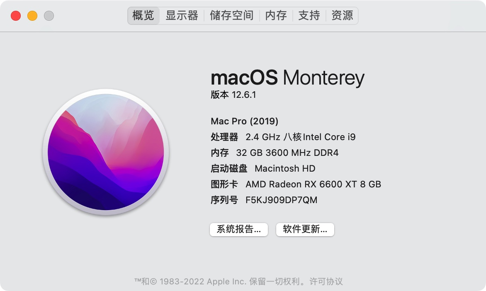
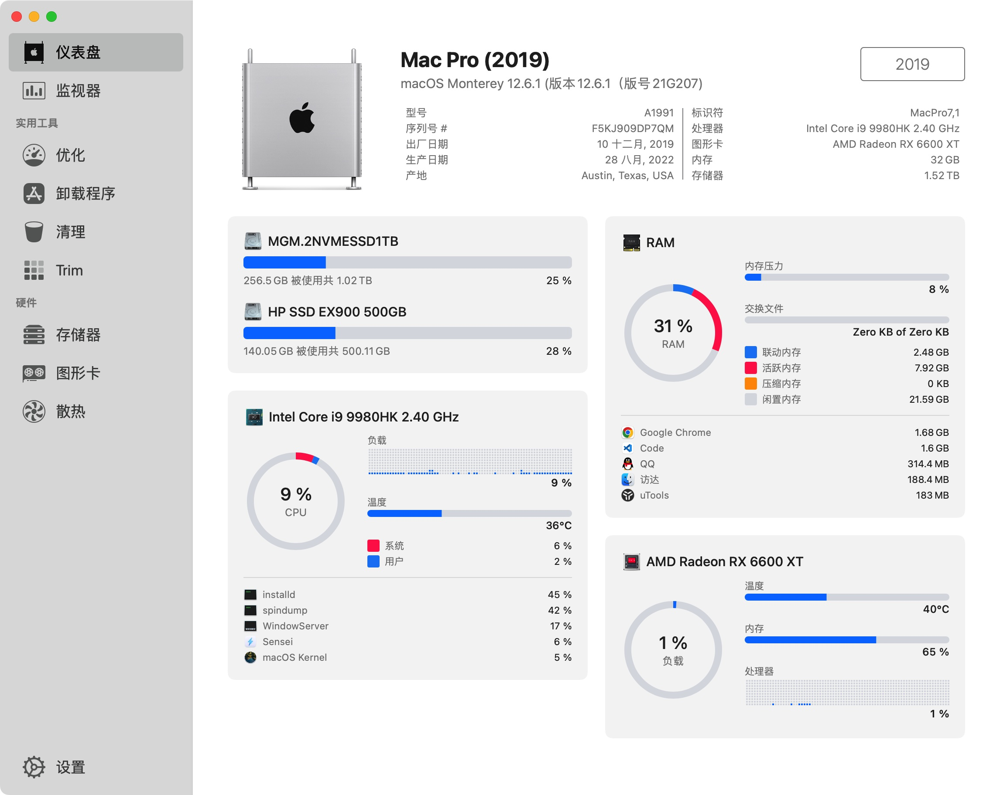
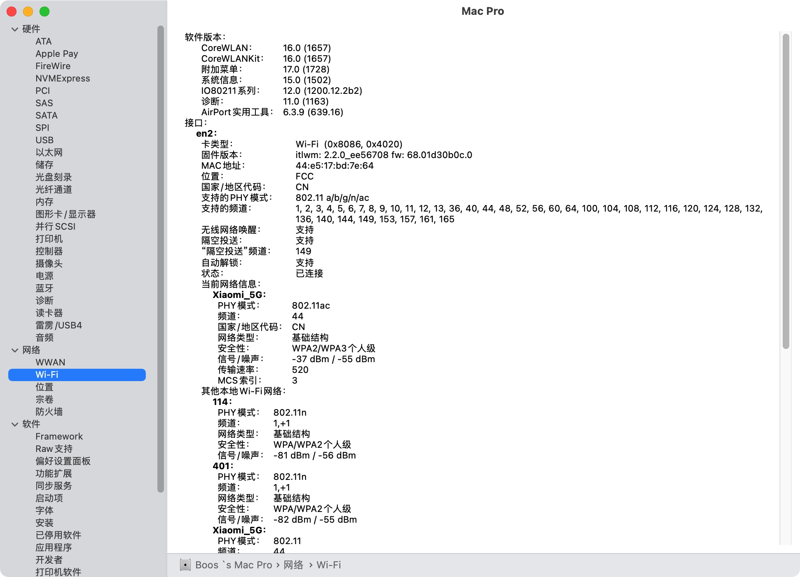
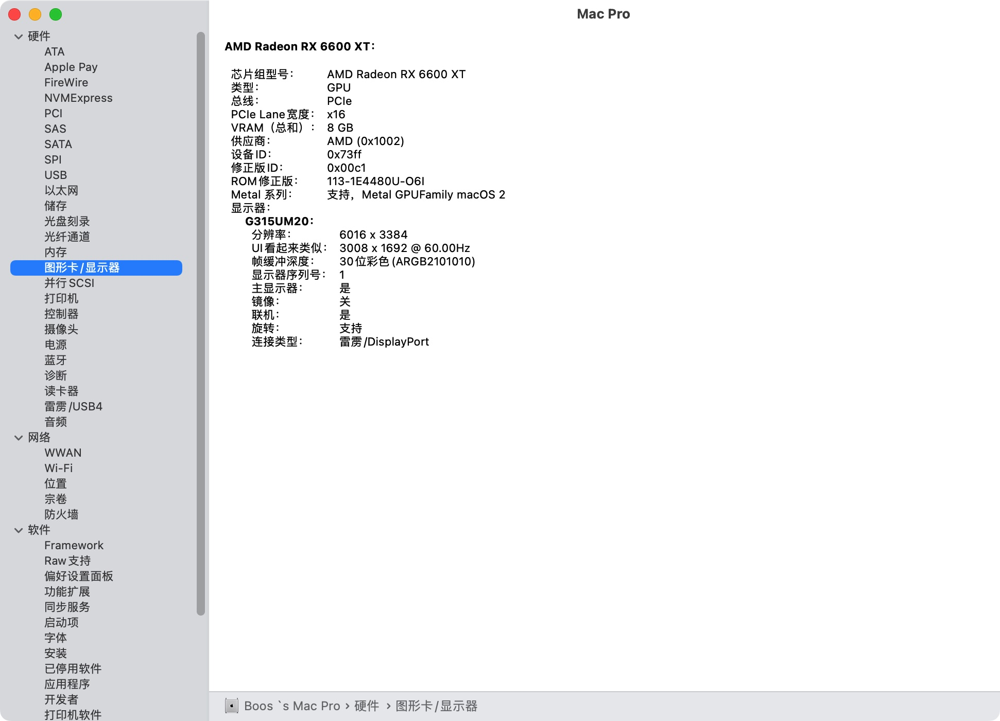
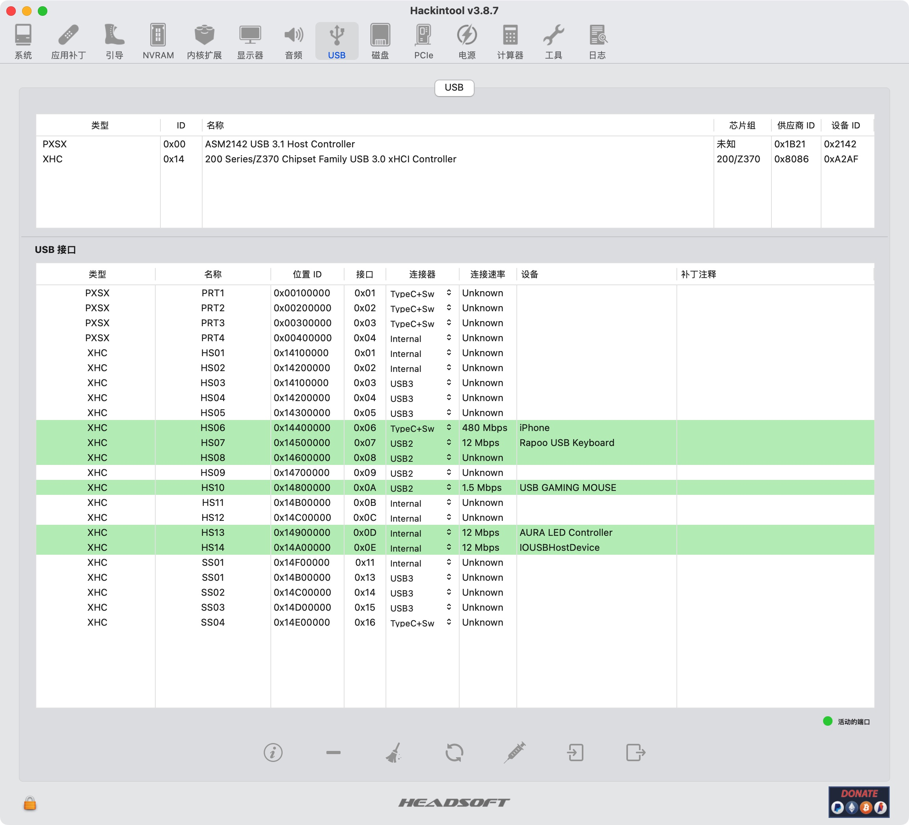
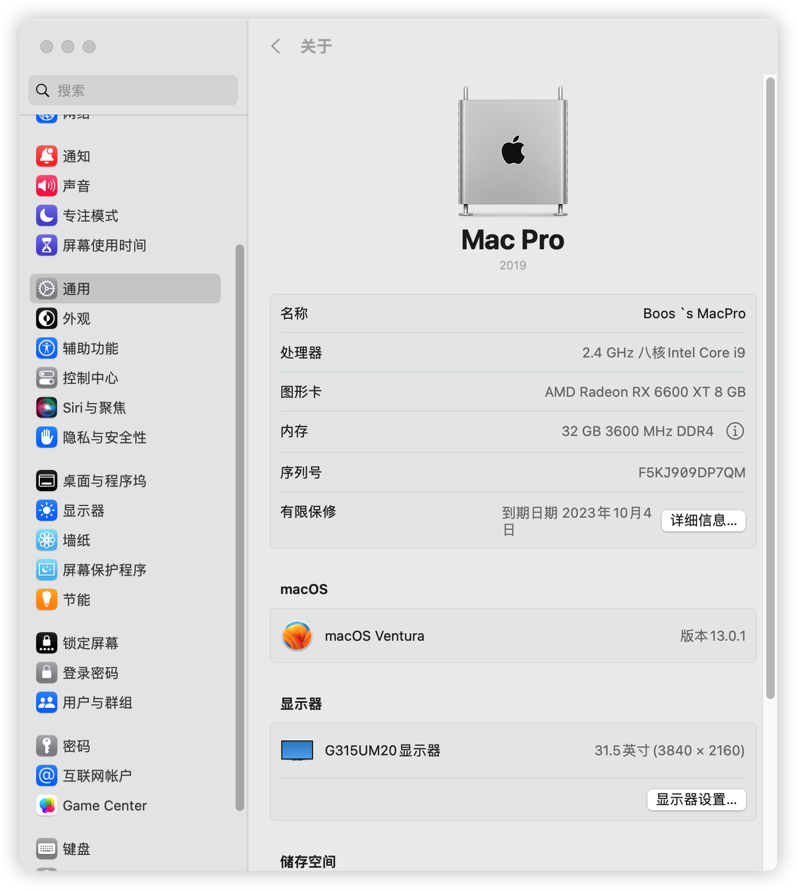

# OpenCore 0.8.7

|             |                                                              |                               |
| ----------- | ------------------------------------------------------------ | ----------------------------- |
| MotherBoard | ROG-STRIX-Z370i                                              | [MOD Bios By Myself](ASUSTeK_ROG_STRIX_Z370-I_GAMING_3005.389ABCD.bin)                      |
| CPU         | I9-9980HK                                                      | 8C16T                          |
| Memory      | CJR 3600 Mhz                                               | 16G*2                          |
| GPU         | AMD Radeon RX 6600XT 8 GB / Intel HD Graphics 630               |  NITRO+   |
| WIFI        | AX210                                                  | WIFI 6E 3Gbps / BT 5.2 |
| Ethernet    | Intel I219V2                                                 |                               |
| Disk        | KINGSTON SV300S37A120G / HP SD EX900 500GB | Enable **TRIM**               |

